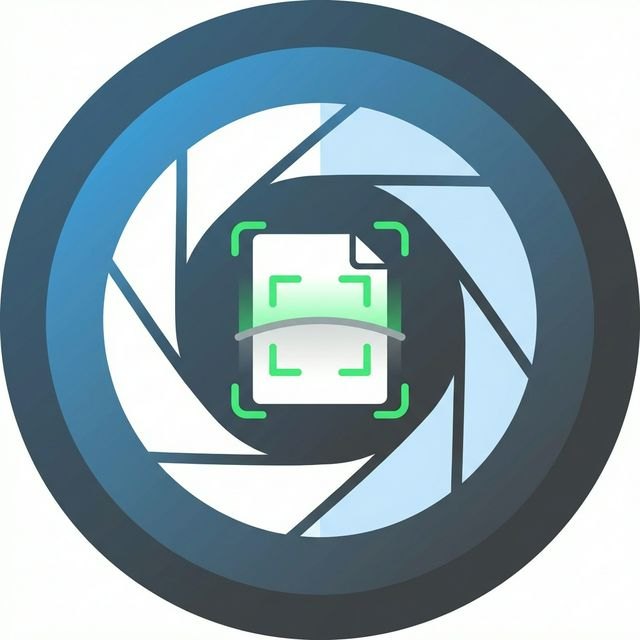

<div align="center">
  
  <h1>React Native Live Document Edge Detection</h1>
  <p>A high-performance, real-time document edge detection and crop library for React Native (iOS & Android).</p>

[](https://www.npmjs.com/package/react-native-live-detect-edges)
[](https://github.com/loijwdev/react-native-live-detect-edges/blob/main/LICENSE)
[](https://www.android.com)
[](https://developer.apple.com/ios)

</div>

---

## 📱 Demo

|           iOS (Live Detection)           |           Android (Live Detection)           |
| :--------------------------------------: | :------------------------------------------: |
|  |  |

|            iOS (Manual Crop)             |            Android (Manual Crop)             |
| :--------------------------------------: | :------------------------------------------: |
|  |  |

---

## 🚀 Features

- **Real-time Edge Detection**: Detects document boundaries instantly from the camera feed.
- **Cross-Platform**: Fully supported on **iOS** and **Android**.
- **High Quality Capture**: Captures high-resolution images of the document.
- **Perspective Correction**: Automatically crops and warps the detected document to a flat rectangle.
- **Customizable UI**: Customize the overlay color, stroke width, and more.
- **TypeScript Support**: First-class TypeScript definitions included.

## 📦 Installation

```sh
npm install react-native-live-detect-edges
# or
yarn add react-native-live-detect-edges
```

### iOS Setup

Don't forget to install the pods:

```sh
cd ios && pod install
```

Add the following key to your `Info.plist` to request camera permission:

```xml
<key>NSCameraUsageDescription</key>
<string>We need access to your camera to scan documents.</string>
```

### Android Setup

Ensure you have the camera permission in `AndroidManifest.xml` (the library adds it, but your app must request it at runtime):

```xml
<uses-permission android:name="android.permission.CAMERA" />
```

## 💻 Usage

### 1. The Scanner View (`LiveDetectEdgesView`)

This component renders the camera preview with the live edge detection overlay.

```tsx
import { LiveDetectEdgesView } from 'react-native-live-detect-edges';

<LiveDetectEdgesView
  style={{ flex: 1 }}
  overlayColor="rgba(0, 255, 0, 0.5)"
  overlayStrokeWidth={4}
/>;
```

### 2. Capturing and Cropping (`takePhoto`)

Use the `takePhoto` method to capture the current document. It returns the full image and the detected corner points.

```tsx
import { takePhoto } from 'react-native-live-detect-edges';

const handleCapture = async () => {
  try {
    const result = await takePhoto();
    console.log('Original Image:', result.originalImage.uri);
    console.log('Cropped Image:', result.image.uri); // Auto-cropped if detected
  } catch (error) {
    console.error('Capture failed:', error);
  }
};
```

### 3. Manual Cropping (`cropImage`)

If you want to manually adjust the crop points (e.g., in a custom UI), use `cropImage`.

```tsx
import { cropImage } from 'react-native-live-detect-edges';

const result = await cropImage({
  imageUri: 'file:///path/to/image.jpg',
  quad: {
    topLeft: { x: 100, y: 100 },
    topRight: { x: 400, y: 100 },
    bottomRight: { x: 400, y: 500 },
    bottomLeft: { x: 100, y: 500 },
  },
});

console.log('New Cropped URI:', result.uri);
```

### 4. Advanced Usage: Drag & Drop Crop UI

To obtain the `quad` (Quadrilateral) coordinates for manual cropping, you typically need a UI that allows users to drag corner points over the image.

We provide a full example of such a UI using `react-native-gesture-handler` and `react-native-reanimated` in the example app.

👉 **Check out the implementation here:** [example/src/screens/CropScreen.tsx](example/src/screens/CropScreen.tsx)

## 🧩 API Reference

### `<LiveDetectEdgesView />` Props

| Prop                 | Type        | Default                  | Description                                                                                                     |
| -------------------- | ----------- | ------------------------ | --------------------------------------------------------------------------------------------------------------- |
| `overlayColor`       | `string`    | `"rgba(0, 255, 0, 0.5)"` | The color of the edge detection overlay (stroke).                                                               |
| `overlayFillColor`   | `string`    | `undefined`              | The fill color of the detected area. Defaults to a semi-transparent version of `overlayColor` if not specified. |
| `overlayStrokeWidth` | `number`    | `4`                      | The thickness of the detection lines.                                                                           |
| `style`              | `ViewStyle` | -                        | Standard React Native style prop.                                                                               |

### Methods

#### `takePhoto(): Promise<TakePhotoResult>`

Captures the current frame, attempts to detect edges, and saves both the original and a cropped version.

**Returns:**

- `originalImage`: `{ uri, width, height }`
- `image`: `{ uri, width, height }` (The auto-cropped result)
- `detectedPoints`: `Quadrilateral` (Corner points in image coordinates)

#### `cropImage(params): Promise<CropImageResult>`

Performs a perspective transform on an image given specific corner points.

**Params:**

- `imageUri`: `string` (Local file path)
- `quad`: `Quadrilateral` (`topLeft`, `topRight`, `bottomRight`, `bottomLeft`)

## 🤝 Contributing

See the [contributing guide](CONTRIBUTING.md) to learn how to contribute to the repository and the development workflow.

## 👏 Acknowledgements

Special thanks to the authors of these amazing libraries:

- **Android**: Big thanks to [pynicolas](https://github.com/pynicolas) for [FairScan](https://github.com/pynicolas/FairScan). This library provided the core inspiration and logic for the Android implementation.
- **iOS**: Huge shoutout to the team at [WeTransfer](https://github.com/WeTransfer) and all contributors of [WeScan](https://github.com/WeTransferArchive/WeScan) for building such a robust foundation.

## 📄 License

MIT

---

Made with [create-react-native-library](https://github.com/callstack/react-native-builder-bob)
